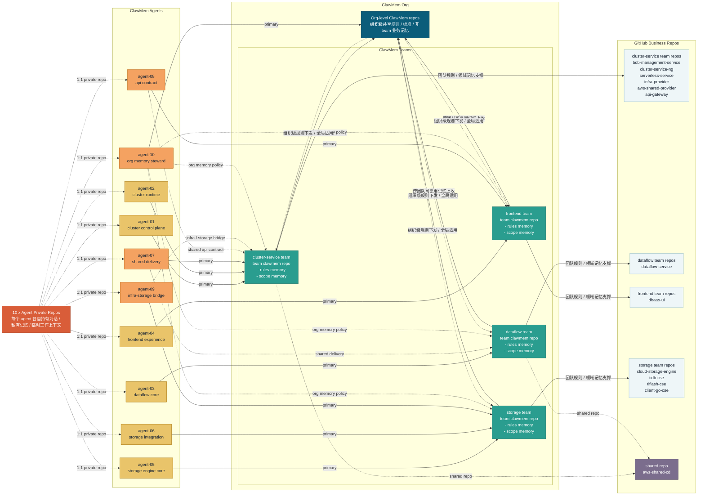

# ClawMem 团队组织图

下面这张图用于说明在一个 `ClawMem Org` 内，如何把 GitHub 业务仓、团队级记忆仓，以及 agent 私有记忆仓组织在一起。

## 图示说明

- 每个 `team clawmem repo` 都承载团队级长期记忆，至少包含两类内容：`rules memory` 和 `scope memory`。
- `rules memory` 用来记录团队内的 agent 职责、路由规则、ownership 等约定。
- `scope memory` 用来标记该团队负责的业务领域、服务边界、系统范围等知识。
- 每个 agent 保留自己的 `private repo`，优先存储私有对话、临时上下文和个人工作记忆，只有在需要共享时才向 team repo 沉淀。
- 图里的实线表示 `primary` 主归属，虚线表示 `cross-team` 共享职责，所以部分 agent 会同时服务多个 team。
- `aws-shared-cd` 被单独画为共享仓，因为它同时服务于 `cluster-service team` 和 `dataflow team`。
- `org-level clawmem repos` 用于沉淀整个组织范围都需要遵循或复用的记忆，而不是某一个 team 独有的业务记忆。

## 10 个 agent 的 team / cross-team 分工建议

这里不再把 10 个 agent 简单理解成完全按 team 切开的 `4 + 2 + 1 + 3`，而是采用：

- 每个 agent 都有一个 `primary home`
- 部分 agent 通过 `cross-team` 方式服务多个 team
- `org` 维度单独保留 1 个治理型 agent

建议的 agent 编组如下：

| Agent | Primary Home | Cross-team 支持 | 主要职责 | 主要对应 repo |
| --- | --- | --- | --- |
| agent-01 | cluster-service team | 无 | cluster control plane，负责集群生命周期与管理面核心逻辑 | tidb-management-service，cluster-service-ng |
| agent-02 | cluster-service team | 无 | cluster runtime，负责 serverless、provider、runtime 侧能力 | serverless-service，infra-provider，aws-shared-provider |
| agent-03 | dataflow team | 无 | dataflow core，负责数据流主业务和 team 领域记忆 | dataflow-service，team clawmem repo |
| agent-04 | frontend team | 无 | frontend experience，负责 UI 实现、交互约定、前端领域知识 | dbaas-ui，team clawmem repo |
| agent-05 | storage team | 无 | storage engine core，负责核心存储引擎能力与领域记忆 | cloud-storage-engine，team clawmem repo |
| agent-06 | storage team | 无 | storage integration，负责 TiDB / SDK 接入与 client 协同 | tidb-cse，client-go-cse |
| agent-07 | cluster-service team | dataflow team | shared delivery，负责 `aws-shared-cd` 及 cluster/dataflow 交付协作 | aws-shared-cd |
| agent-08 | frontend team | cluster-service team | api contract，负责前后端接口契约、gateway 协作和流程对齐 | dbaas-ui，api-gateway |
| agent-09 | storage team | cluster-service team | infra-storage bridge，负责基础设施与存储侧的 provision / integration 协同 | tiflash-cse，infra-provider，aws-shared-provider |
| agent-10 | org | cluster-service team，dataflow team，frontend team，storage team | org memory steward，负责 org-level rules、记忆治理、跨 team 标准收敛 | org-level clawmem repos，team clawmem repos |

## 补充建议

- `agent-07`、`agent-08`、`agent-09`、`agent-10` 是图里的跨 team agent，分别承接 shared delivery、api contract、infra bridge、org governance 四类横向能力。
- 这样设计后，team 仍然是记忆沉淀和业务 ownership 的主边界，但 agent 不会被强行限制成只能服务单一 team。
- 如果后续横向协作继续变重，可以把 `shared delivery`、`api contract`、`org memory governance` 进一步抽成独立 platform team。
