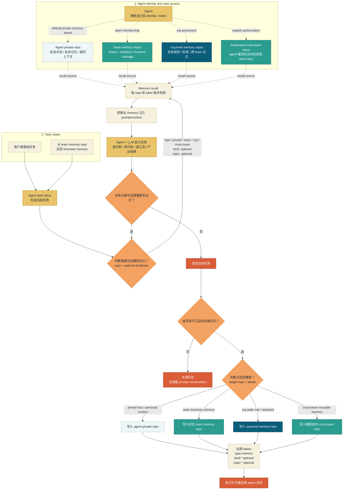

# ClawMem Team Agent Workflow

下面这张图用于说明在 ClawMem org/team 结构下，一个 agent 如何从任务入口开始，按需召回不同 memory repo 中的记忆，并在任务完成后把新的长期记忆沉淀回合适的 repo。

组织结构背景见 [ClawMem 团队组织图](./clawmem-team-organization.md)。

## 读图方式

- `Agent private repo` 是 agent 的默认私有记忆空间，适合保存个人对话、临时上下文和不需要团队共享的记忆。
- `Team memory repos` 是 team 的长期共享记忆空间，适合保存业务领域知识、`kind:task`、`kind:rule`、`kind:scope` 等团队可复用内容。
- `Org-level memory repos` 保存全组织都适用的规则、标准、流程和跨 team 共识。
- `Cross-team repos` 表示 agent 被显式授权访问的其他 team memory repo，用来支持 shared delivery、API contract、infra bridge 等跨 team 工作。
- 召回和沉淀都要先做 routing 判断：选择哪个 memory repo，以及是否需要附加 `kind:*`、`topic:*` 等 label 条件。
- `kind` 和 `topic` 都是可选条件；没有明确分类时，agent 也可以只按 repo 范围和语义相关性召回或沉淀。
